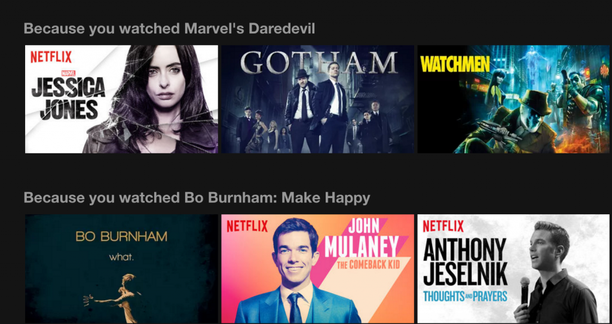

# Building a MovieLens Recommender System

## Overview

This project demonstrates how to build recommender systems using the [MovieLens](https://grouplens.org/datasets/movielens/) dataset. The systems utilize collaborative filtering and content-based filtering techniques to generate movie recommendations, similar to those used by platforms like Spotify, Amazon, and Netflix.

## Project Outline

1. **Importing Dependencies**: The project uses Python libraries such as NumPy, Pandas, Matplotlib, and Seaborn for data manipulation and visualization.
2. **Loading and Exploring Data**: The MovieLens dataset is loaded and explored to understand its structure and content.
3. **Pre-processing Data**: Data is pre-processed to handle missing values and prepare it for building recommender models.
4. **Building Recommender Systems**:
   - **Collaborative Filtering**: Implemented using K-Nearest Neighbors (KNN) to find similar users or items.
   - **Content-Based Filtering**: Addresses the cold start problem by recommending items based on content similarity.
   - **Matrix Factorization**: Utilizes techniques like Singular Value Decomposition (SVD) for more advanced recommendations.
